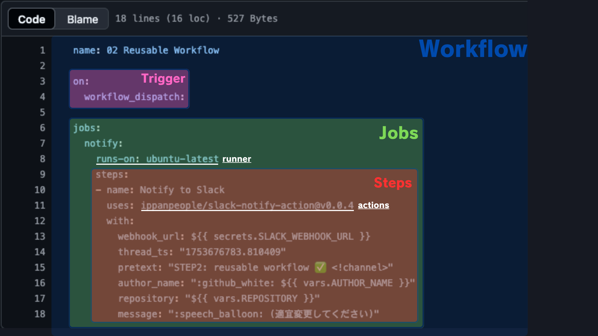

# GitHub Actions 入門
このリポジトリは、Go アプリケーションをさくらの AppRun サービスにデプロイするための GitHub Actions のハンズオン入門を提供します。リポジトリのフォーク、GitHub Actions のセットアップ、アプリケーションのデプロイまでの手順をガイドします。

> [!IMPORTANT]
> 目的: GitHub Actions の概要を理解すること

> [!IMPORTANT]
> ゴール: GitHub Actions の基本コンポーネントについて理解すること

## GitHub Actions とは？
GitHub Actions は、GitHub プロジェクトのための CI/CD ワークフローを作成できる強力な自動化ツールです。リポジトリから直接、ビルド・テスト・デプロイなどのタスクを自動化できます。

## GitHub Actions の基本コンポーネント

## GitHub Actions の主な用語
| 用語                | 説明                                                                                   |
|---------------------|--------------------------------------------------------------------------------------|
| **Actions**         | 自動化ツールのこと。 |
| **actions**         | ワークフロー内で特定のタスクを実行する再利用可能なコード単位（プラグインのようなもの）。 |
| **Workflow**        | `.github/workflows/*.yml` で定義される自動化プロセス。トリガー、ジョブ、ステップを含む。   |
| **Trigger**         | ワークフローを開始するイベント（例: `push`、`pull_request`、手動実行など）。               |
| **Jobs**            | 同じランナー環境（仮想マシンなど）で実行されるステップの集合。並列または順次実行が可能。    |
| **Steps**           | ジョブ内の個々のタスク。コマンド実行やアクションの呼び出しができる。                      |
| **Secrets**         | API トークンなどの機密情報を安全に保存する暗号化環境変数。                              |
| **Environment Variables** | ステップやジョブ間で値を再利用するための変数。グローバルまたはローカルで設定可能。      |
| **Runners**         | ジョブを実行する仮想マシンやコンテナ。GitHub 提供のホストランナー（例: `ubuntu-latest`）が利用可能。 |
| **Matrix**          | 複数のパラメータ（例: OS や Node.js バージョン）でジョブを組み合わせて実行できる機能。     |
| **Artifacts**       | ワークフローで生成されるファイル（ビルド成果物など）。ジョブ間で保存・共有が可能。         |
| **Reusable Workflows** | 他のワークフローから呼び出せる再利用可能なワークフロー。保守性・再利用性向上に有効。   |
| **Composite Actions** | 複数のシェルステップで構成されるカスタムアクション。共通ロジックのまとめに便利。         |
