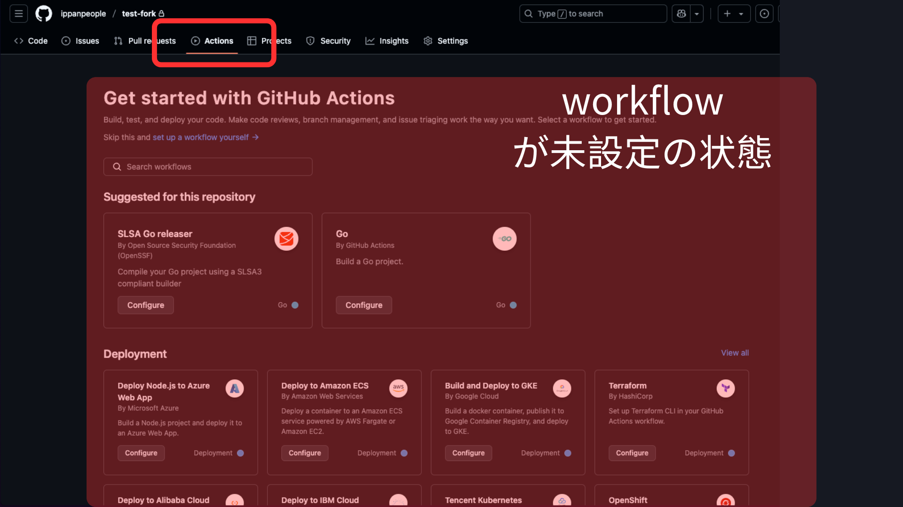
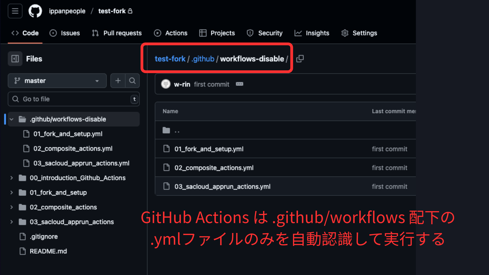
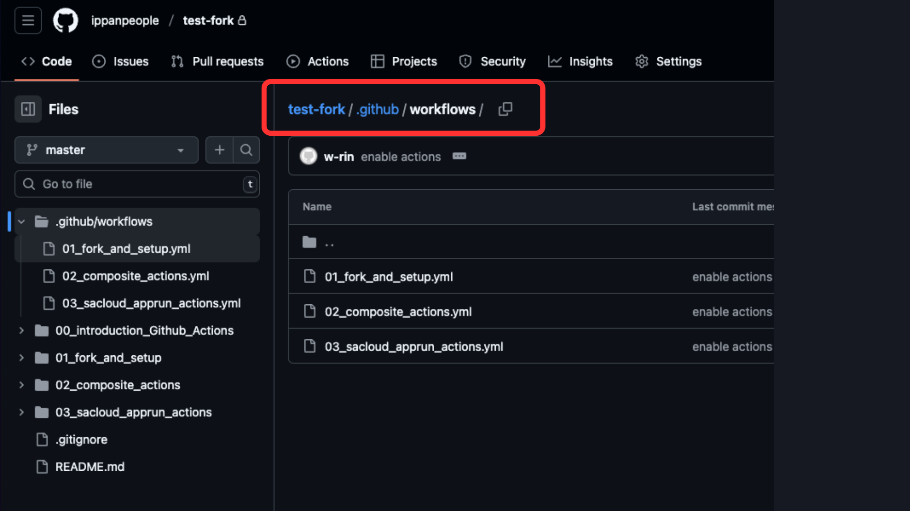
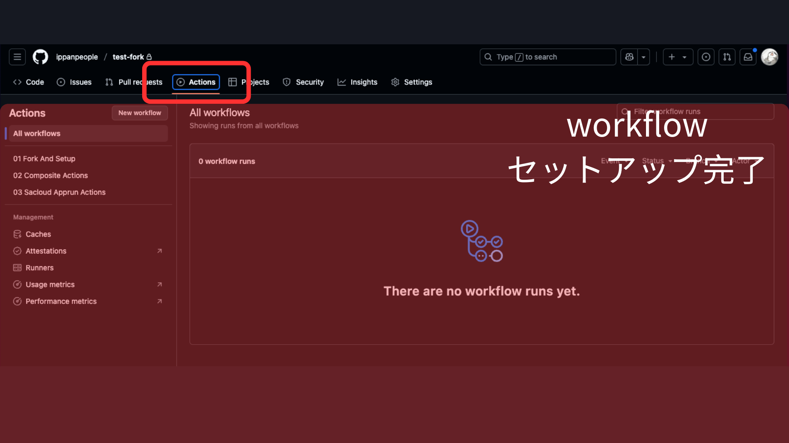
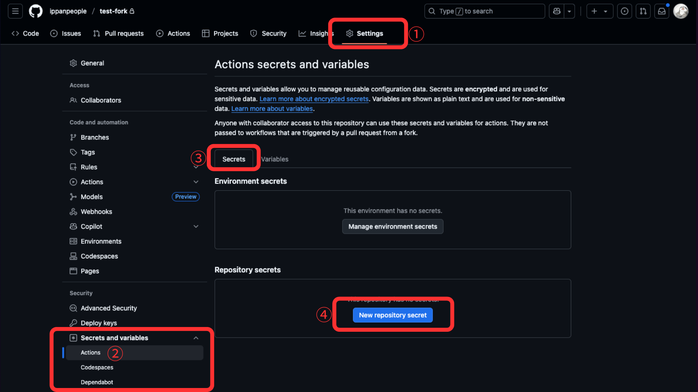
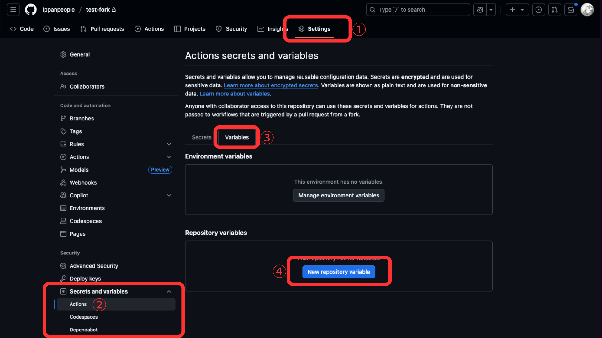
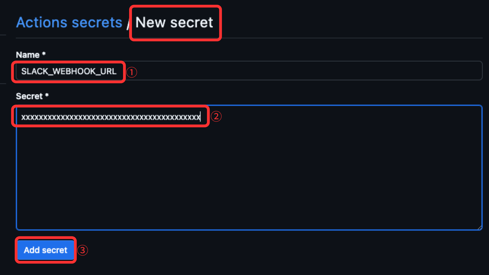
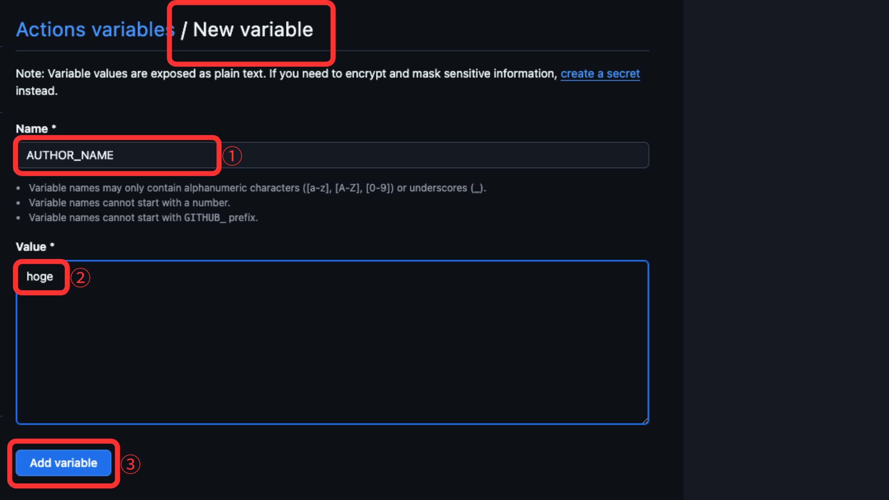
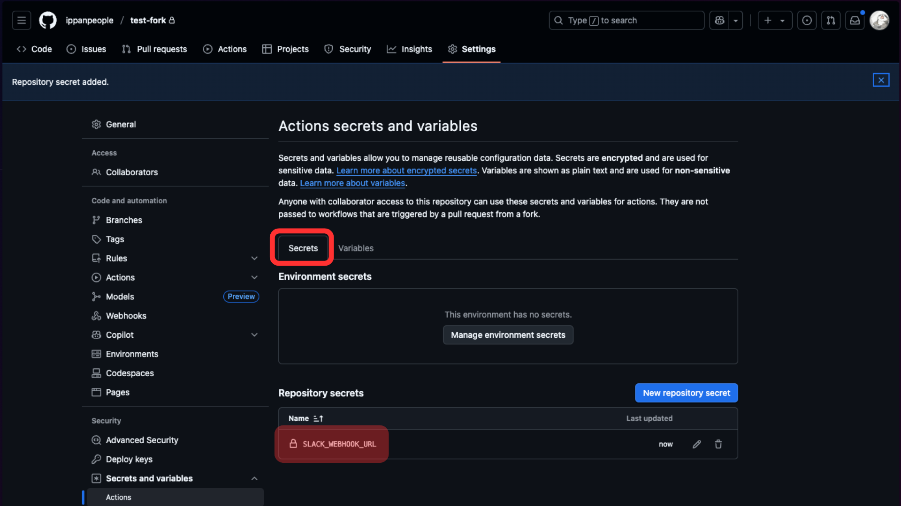
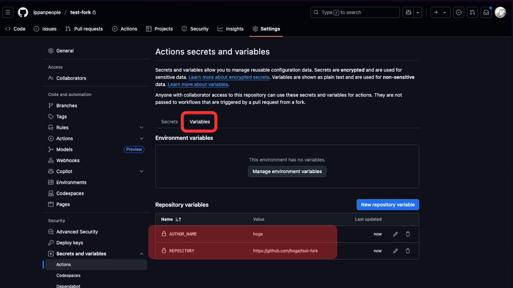

# 01 GitHub Actions のフォークとセットアップ
このステップでは、リポジトリのフォークと GitHub Actions のセットアップ方法を解説し、Go アプリケーションをさくらの AppRun サービスにデプロイするための準備を行います。

> [!IMPORTANT]
> 目的: GitHub Actions でワークフローを実行するための設定方法を理解する

> [!IMPORTANT]
> ゴール: GitHub Actions のパーミッション、シークレット、変数の設定と、トリガーによるワークフロー実行の確認

## GitHub Actions の有効化方法

## GitHub Actions のシークレットと変数の設定方法

## To Do リスト
- [ ] (リポジトリをフォークする)[https://github.com/ippanpeople/test]
- [ ] GitHub Actions をセットアップする
    - [ ] ワークフローのパーミッションを「Read and write」および「Allow GitHub Actions to create and approve pull requests」に設定
    - [ ] Actions Secret `SLACK_WEBHOOK_URL` を作成し、Slack の Incoming Webhook URL を登録
    - [ ] Actions Variable `AUTHOR_NAME` を作成し、自分の名前を登録
    - [ ] Actions Variable `REPOSITORY` を作成し、自分の GitHub リポジトリリンクを登録
- [ ] ワークフローを設定し、Slack へメッセージを送信できるようにする
    - [ ] ワークフロー内の "text" を自分のメッセージに更新
    - [ ] 変更をリポジトリにプッシュ
- [ ] ワークフローが Slack へメッセージを送信できるかテスト
    - [ ] リポジトリの Actions タブに移動
    - [ ] 対象ワークフローを選択し「Run workflow」をクリック
    - [ ] Slack チャンネルにメッセージが表示されることを確認

