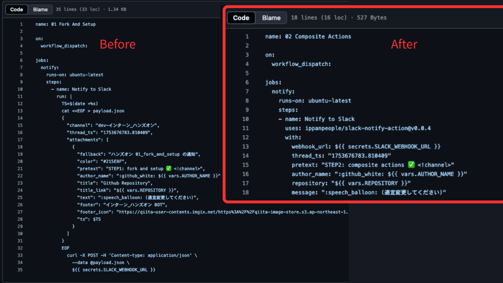

# 02 Composite Actions の紹介
前のステップでは、GitHub Actions の基本設定を行い、`run` でランナー内にコマンドを実行しました。このステップでは、Composite Actions を活用し、再利用可能なアクションによってワークフローの可読性と保守性が向上することを学びます。

> [!IMPORTANT]
> 目的: 実務では actions で複雑な処理を行うことが多いため、Composite Actions を使って再利用可能なアクションを作成する方法を学ぶ

> [!IMPORTANT]
> ゴール: Composite Actions を使う際のイメージを理解する

## Composite Actions とは？
Composite Actions は、複数のシェルステップを組み合わせて作成されるカスタムアクションです。YAML で記述され、GitHub Actions のワークフロー内で再利用可能なロジックを提供します。これにより、複雑な処理を簡潔にまとめ、再利用性を高めることができます。

>[!NOTE]
> 今回通知用に利用する actions: [slack-notify-action](https://github.com/ippanpeople/slack-notify-action/blob/master/action.yml)

## Composite Actions の基本構成要素
Composite Actions は、以下の要素で構成されます。
- **name**: アクションの名称
- **description**: アクションの説明
- **inputs**: アクションが受け取る入力パラメータ
- **runs**: アクションが実行するコマンドやスクリプト（シェルコマンドや他のアクションの呼び出しが可能）

## 前のステップとの比較

## To Do リスト
- [ ] ワークフローを設定し、Slack へメッセージを送信できるようにする
    - [ ] ワークフロー内の message を自分のメッセージに更新
    - [ ] 変更をリポジトリにプッシュ
- [ ] ワークフローが Slack へメッセージを送信できるかテスト
    - [ ] リポジトリの Actions タブに移動
    - [ ] 対象ワークフローを選択し「Run workflow」をクリック
    - [ ] Slack チャンネルにメッセージが表示されることを確認

